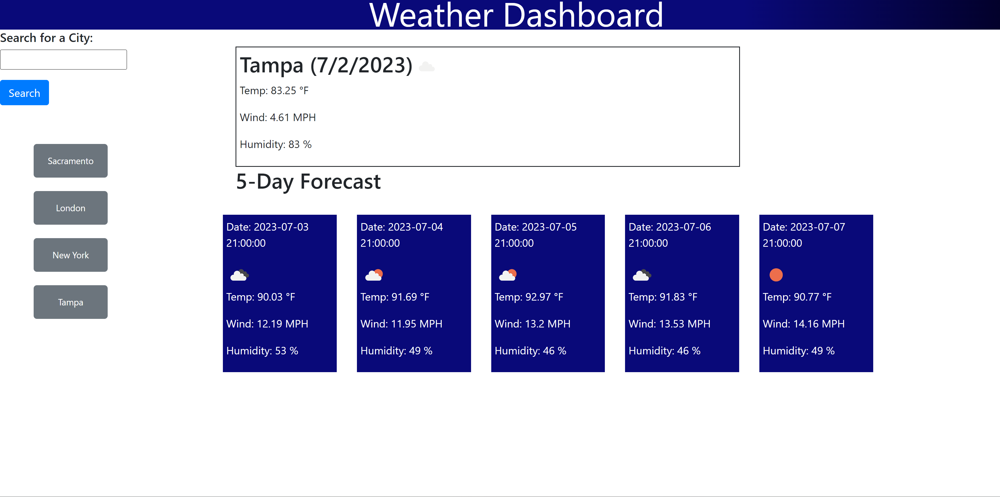

# tutTutLooksLikeRain

## Description

This website allows a user to search for a current and future five day weather forecast. The website saves the city in a list and will display the weather for that city when the button is clicked.

## Installation

No installation necessary.

## Usage

Follow this link to get to the website: [Tut Tut Looks Like Rain](https://athenamw.github.io/tutTutLooksLikeRain/)

[Repository](https://github.com/athenamw/tutTutLooksLikeRain)

[HTML](https://github.com/athenamw/tutTutLooksLikeRain/blob/main/index.html)

[Javascript](https://github.com/athenamw/tutTutLooksLikeRain/blob/main/assets/script.js)

[CSS](https://github.com/athenamw/tutTutLooksLikeRain/blob/main/assets/script.js)

This is a screenshot for the Home page

## Credits

The APIs that we used were:

- [Current Weather](https://api.openweathermap.org/data/2.5/weather?q=${cityName}&appid=616ee85e0800531ffd57bf53410a822b&units=imperial`)
- [Future Weather](https://api.openweathermap.org/data/2.5/forecast?q=${cityName}&appid=616ee85e0800531ffd57bf53410a822b&units=imperial)

We also used Google for various tutorials and reference. Other people that helped with the project include: Dru Sachez (tutor) and Vijay Gaonkar (boyfriend).
